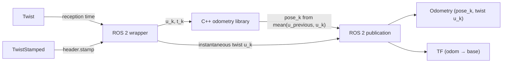

# ground_vehicle_twist_odometry

This package estimates a ground vehicle's planar pose (`x`, `y`, `yaw`) by integrating base velocity samples. The pose describes motion relative to the current odometry origin. ROS 2 executables receive `Twist` or `TwistStamped` messages and publish the estimate. A C++ library performs the integration independently of ROS 2.

## What this package launches

The launch file selects the input message type through `use_stamped_twist`, which defaults to `False`. With `use_stamped_twist:=False`, it starts `ground_vehicle_twist_odometry_node` and receives `Twist`. With `use_stamped_twist:=True`, it starts `ground_vehicle_twist_odometry_node_w_timestamp` and receives `TwistStamped`. Both variants use the same odometry library and the default ROS node name `ground_vehicle_twist_odometry`.

Both executables:

- subscribe to `twist`
- publish `nav_msgs/msg/Odometry` on `odom`
- provide a `reset_odom` service with type `std_srvs/srv/Empty`
- publish the TF transform `<odometry_frame> -> <base_frame>` when `publish_tf` is `true`

Connect `twist` to the velocity feedback (echo) returned by the vehicle, containing the measured or estimated velocity of its base. Commands such as `cmd_vel` describe requested motion and can differ from the actual movement returned by the vehicle.

The `namespace` launch argument defaults to `robot` for standalone use. A caller can pass a complete robot namespace, such as `/robots/robot_01`. This launch uses that namespace directly and does not append a robot name.

The package also installs `config/example_ground_vehicle_twist_odometry.yaml`, which contains the default functional parameters for the node. The launch file configures `use_sim_time` separately.

## Configuration model

`params_file` is loaded when it resolves to a non-empty path.

If you do not pass `params_file`, the default value points to the example YAML installed by this package. If you pass your own YAML file, that file is used instead.

The launch file does not expose individual functional node parameters. Consequently, CLI launch arguments cannot override selected values from `params_file`. To change a functional parameter, edit or replace the parameter file.

`use_sim_time` is the deliberate exception. The launch environment decides whether the node uses the system clock or the ROS simulation clock. The launch file appends this value after loading the YAML file, so the `use_sim_time` launch argument takes precedence if a custom YAML file also defines the parameter. Parameter files should therefore omit `use_sim_time`.

When `params_file_allow_substs` is `True`, expressions such as `$(var robot_name)` can use keys already present in the launch context. This is mainly useful when a parent launch file includes this launch file and provides those keys. Literal YAML values are always used as written.

`node_args` accepts one JSON object with the supported `launch_ros.actions.Node` arguments. It can configure the node name, remappings, output, respawn behavior, and ROS arguments.

`use_stamped_twist` selects the executable in the launch file and does not belong in the node parameter YAML. Both input variants share `namespace`, `params_file`, `params_file_allow_substs`, `use_sim_time`, and `node_args`.

## How the node integrates twist

Both ROS 2 inputs use the same C++ integrator.



The input velocities must describe the origin of `base_frame` and be expressed in that frame. `linear.x` and `linear.y` are in m/s, and `angular.z` is in rad/s. This contract applies regardless of whether the robot uses differential, steering, or omnidirectional drive.

The first valid sample establishes the starting time and zero pose. When the next sample arrives, the library averages the two planar twists and integrates that average over the complete time interval. The calculation accounts for the robot turning while it moves, including lateral velocity. It is exact for a constant body twist and approximates motion between changing samples. The published pose belongs to the new sample time; `odom.twist` contains the *new instantaneous* twist, not the average used to integrate the pose.

`Twist` has no timestamp, so its executable assigns the node's reception time to each sample. `TwistStamped` uses `header.stamp`; the publisher must set it to the measurement time and use a clock consistent across samples. The wrapper does not transform velocities from another frame.

Repeated timestamps replace the retained velocity without integrating. Older timestamps and non-finite velocities are rejected without changing the pose or retained sample. Every positive time interval is integrated in full, including an unusually long one. The `expected_incoming_twist_msg_rate` parameter only triggers a warning when the measured rate falls below its configured value; it never changes the integration. Set it to the minimum rate accepted by your producer. `reset_odom` clears the pose and retained sample, so the next valid sample establishes a new origin.

The published pose and twist covariance diagonals retain fixed values from the earlier node. These values are **not calibrated uncertainty estimates**; the input `Twist` does not supply the measurement uncertainty needed to calculate them.

## Examples

### Example 1. Launch with the default parameter file

```bash
ros2 launch ground_vehicle_twist_odometry ground_vehicle_twist_odometry.launch.py
```

This command uses the default `params_file`, which points to `config/example_ground_vehicle_twist_odometry.yaml`.

That file contains the functional parameter tree and uses literal values.

```yaml
/**/ground_vehicle_twist_odometry:
  ros__parameters:
    odometry_frame: robot_odom
    base_frame: robot_base_link
    publish_tf: true
    expected_incoming_twist_msg_rate: 40.0
```

With the default namespace `robot`, the input is `/robot/twist`, the output is `/robot/odom`, and the reset service is `/robot/reset_odom`. In another terminal, check that the vehicle feedback arrives and that odometry is published.

```bash
ros2 topic echo /robot/twist --once
ros2 topic echo /robot/odom --once
```

The node publishes its first odometry message after two valid samples with increasing timestamps. If the vehicle publishes its feedback under another topic name, connect it with a remapping as shown in the next example.

### Example 2. Launch with a custom parameter file

```bash
ros2 launch ground_vehicle_twist_odometry ground_vehicle_twist_odometry.launch.py \
  namespace:=robot_01 \
  params_file:=/path/to/my_ground_vehicle_twist_odometry.yaml \
  node_args:='{"remappings":[["twist","velocity_echo"]]}'
```

The custom `params_file` owns every functional node parameter. Use the `use_sim_time` launch argument to select the clock.

The remapping connects the input to `/robot_01/velocity_echo`, the example name for the vehicle's velocity feedback topic. Replace `velocity_echo` with your vehicle's topic name; use an absolute name if the feedback is published outside the selected namespace. Odometry is published on `/robot_01/odom`. The node keeps its default name, so the top-level YAML key remains `/**/ground_vehicle_twist_odometry`. If you change the node name through `node_args`, update that YAML key accordingly.

```yaml
/**/ground_vehicle_twist_odometry:
  ros__parameters:
    odometry_frame: odom
    base_frame: base_link
    publish_tf: true
    expected_incoming_twist_msg_rate: 50.0
```

### Example 3. Substitutions provided by a parent launch file

The parameter file may contain substitutions when a parent launch file already owns the substituted context keys. For example, a parent can provide the frame names used by several child launch files.

The child launch still receives one parameter file for its functional configuration.

```yaml
/**/ground_vehicle_twist_odometry:
  ros__parameters:
    odometry_frame: $(var robot_odometry_frame)
    base_frame: $(var robot_base_frame)
    publish_tf: true
    expected_incoming_twist_msg_rate: 50.0
```

### Example 4. Use timestamped velocity samples

```bash
ros2 launch ground_vehicle_twist_odometry ground_vehicle_twist_odometry.launch.py \
  use_stamped_twist:=True \
  namespace:=robot_01 \
  params_file:=/path/to/my_ground_vehicle_twist_odometry.yaml \
  node_args:='{"remappings":[["twist","velocity_echo"]]}'
```

This example uses the same parameter file and remapping as Example 2. The vehicle must publish `TwistStamped` on `/robot_01/velocity_echo` and set `header.stamp` to the measurement time. The node keeps the name `ground_vehicle_twist_odometry`, so the YAML key works with either input type.

### Example 5. Reset odometry

```bash
ros2 service call /robot/reset_odom std_srvs/srv/Empty {}
```

Adjust the service name if you change the namespace or remap `reset_odom`.
